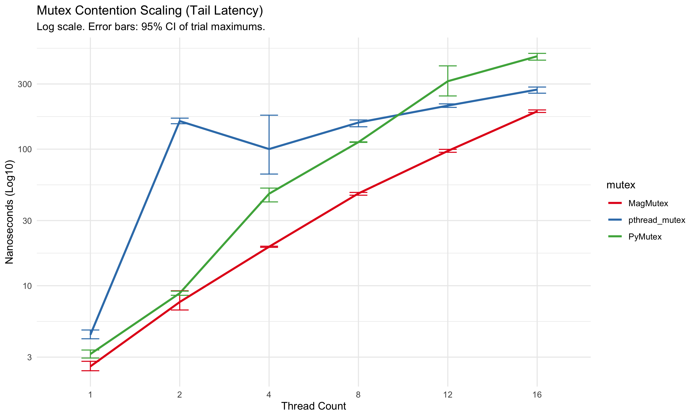
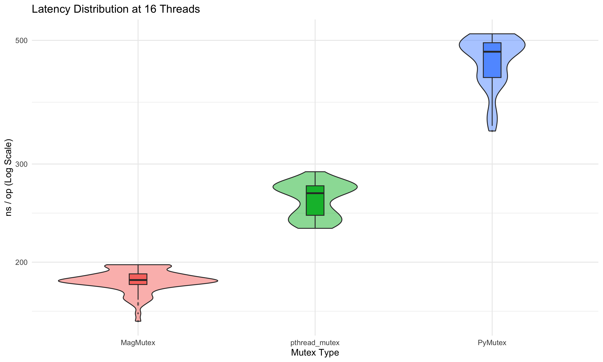

# MagMutex

**1-Byte Mutex for C23**

MagMutex is a "Parking Lot" style synchronization primitive designed for high-concurrency systems, Entity Component Systems (ECS), and large-scale object graphs. It occupies only **1 byte** of memory in Release mode while outperforming `pthread_mutex` and modern runtime locks like Python 3.14's `PyMutex`.

## Performance Profile

<p align="center">
  
  <br>
  <em>Figure 1: Mutex Contention Scaling (Tail Latency). MagMutex shows superior throughput in the 1-8 thread range.</em>
</p>

<p align="center">
  
  <br>
  <em>Figure 2: Latency Distribution at 16 Threads. Note the tight variance of MagMutex compared to PyMutex.</em>
</p>
## Key Features

- **Minimal Footprint:** Exactly 8 bits per mutex (Release mode). Ideal for protecting millions of small objects.
- **Address Sharding:** Uses a 256-bucket global parking lot to eliminate the "Thundering Herd" problem.
- **Cache-Line Alignment:** Buckets are padded to 128 bytes to prevent False Sharing, specifically optimized for Apple Silicon (M1/M2/M3) and modern server CPUs.
- **Decoupled Unlock:** Releases the lock state *before* signaling waiters, allowing high-throughput "barging."
- **Adaptive Spinning:** Intelligent `yield`/`pause` loops reduce kernel context switches for short-held locks.
- **Elite Debugging:** Built-in DFS (Depth First Search) cycle detection to catch deadlocks and recursive locking during development.

## Build from source

```zsh
mkdir build && cd build
cmake -DCMAKE_BUILD_TYPE=Release -DENABLE_TSAN=OFF ..
cmake --build .
```

## Test(Optional)
```zsh
# Assuming you're in build/ directory after finishing build.
./MagMutex > ../benchmark_results.csv
# Then visualize the data.
RScript ../benchmark.r
# Two images should appear in your root.
```

Just be aware that you can't build this with MSVC(cl.exe).

Not a chance. Install LLVM.

## How to use

A mutex is straight-forward to use like any other mutexes.

```c
#include "mag_mutex.h"

// Zero-initialization is valid
MagMutex my_lock = {}; 

void sensitive_operation() {
    MagMutex_Lock(&my_lock);
    
    // Critical Section
    // ...
    
    MagMutex_Unlock(&my_lock);
}
```

## Technical Design

### The State Machine
MagMutex utilizes a bitmask within a single `_Atomic uint8_t`:
- `0x01`: Locked
- `0x02`: Has Waiters (indicates the need to check the Parking Lot)
- `0x04`: Poisoned (critical failure state)

### The Parking Lot
When a thread cannot acquire a lock, it hashes the mutex's memory address to one of 256 global buckets. Each bucket contains:
1. A platform-native mutex to protect the waiter list.
2. A linked list of `Waiter` nodes.
3. **128-byte padding** to ensure no two buckets share a cache line.

## Debug Mode (`MAG_DEBUG`)

Compiling without `NDEBUG` enables a suite of safety features that transform the 1-byte struct into a diagnostic powerhouse:

- **Deadlock Detection:** Automatically builds a dependency graph of held locks. If a thread attempts to acquire locks in an order that creates a cycle, the program aborts with a diagnostic trace.
- **Ownership Tracking:** Detects "Illegal Release" (unlocking a mutex owned by another thread).
- **Recursion Check:** Aborts if a thread attempts to lock a non-recursive mutex it already owns.
- **Poisoning:** Allows marking a mutex as permanently broken (e.g., after a panic in the critical section).

## 💻 Compatibility

- **Language:** C23 with GNU C
- **OS:** Windows (Win32 API), Linux/macOS (POSIX threads)
- **Arch:** Optimized assembly for `aarch64` and `x86_64`

## ⚖ License
MagMutex is released under the MIT License.